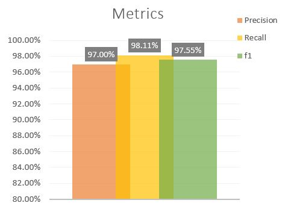

# Phishing-Detection


Phishing is a type of fraud in which the attacker attempts to learn sensitive information by sending emails or other communication channels as a legitimate entity or person, such as login credentials or account information.

A victim usually receives a message that a recognized contact or entity appears to have sent. The message contains malicious software that attacks the user's device, or links to direct victims to malicious websites to trick them into revealing personal and financial information , such as passwords, account IDs or credit card data.

According to the Data description these are the meaning of the values in the data

i.   1 means legitimate

ii.  0 is suspicious

iii. -1 is phishing

## System Information: 

```
Python Version v3.6.9
os Version Linux-4.19.112+-x86_64-with-Ubuntu-18.04-bionic
processor x86_64
```


## Installed Packages

```
scikit-learn==0.22.2
comet-ml==3.2.2
pandas==1.0.5
```
### HyperParameters

```
            {"classifier": [LogisticRegression()],
             "classifier__penalty": ['l2','l1'],
             "classifier__C": np.logspace(0, 4, 10)
             },
 
            {"classifier": [LogisticRegression()],
             "classifier__penalty": ['l2'],
             "classifier__C": np.logspace(0, 4, 10),
             "classifier__solver":['newton-cg','saga','sag','liblinear'] 
             },
 
            {"classifier": [RandomForestClassifier()],
             "classifier__n_estimators": [None, 10, 50, 90, 120],
             "classifier__max_depth":[None, 3, 5, 7],
             "classifier__min_samples_leaf":[None, 1,2,5],
             "classifier__max_leaf_nodes": [None, 2, 5,10]}]
```
### Classification report: 

```

              precision    recall  f1-score   support

          -1       0.98      0.96      0.97      1470
           1       0.97      0.98      0.98      1847

    accuracy                           0.97      3317
    
```
### confusion matrix


### Roc Curve


### Feature Importance


### Results


